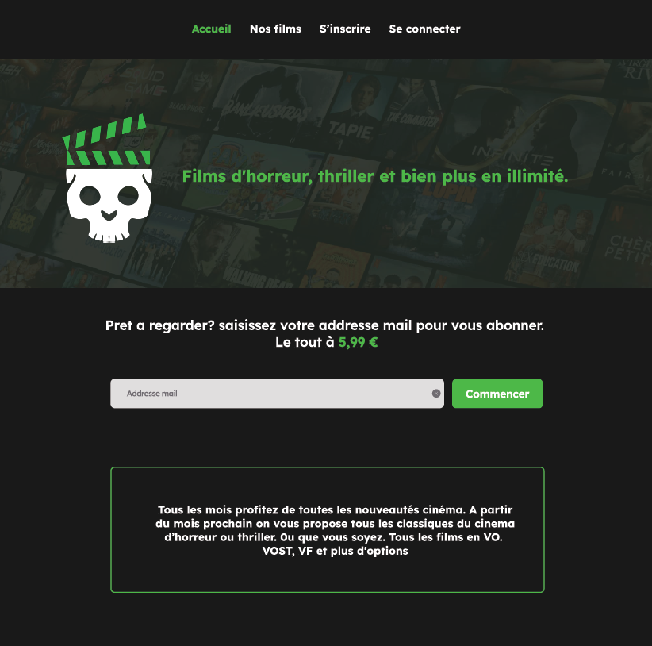

# 📄PROJECT STREAMING D'HORREUR
HorreurVision est une plateforme de streaming dédiée aux films d'horreur, offrant à ses utilisateurs la possibilité de louer et visionner une vaste gamme de titres. L'objectif de ce projet est de fournir une expérience de visionnage de films pratique et conviviale, accessible à un public mondial.

## 🎨Palette graphique

## 📝Police de caractère

## 🔧Technologies Utilisées
>Base de Données : SQL pour stocker les informations sur les films, les utilisateurs.

>Frontend : HTML, CSS et Javascript pour l'interface utilisateur.

>Backend : PHP pour la gestion du formulaire et du système de connexion.
## 🖊️Auteur
Bwango De Bwango AStrid

>[Déploiement du site web](https://codiphenix.github.io/project_streaming_horror)